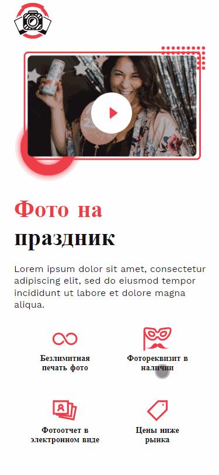

# Photobooth rent mobile application

**Photobooth rent mobile application** - application for renting special photo booths for your event.

## Application information
___
+ the application is created only for mobile devices (max-width 375px)
+ the app is built with create-react-app
+ functional components used
+ for styles used scss
+ for the convenience of working with classes, the library is used ___**classnames**___

## Installation
___
+ clone this repository to your computer
+ open a project in IDE
+ and:

```javascript
npm install
```

## Usage
___
```javascript
npm start
```

## Functional
___
### Video popup

>Video opens in a popup with the ability to stop and close the popup window.



### Sorting photo booths

>When you click on the corresponding field, the photo booths are sorted in ascending and descending order.


### View faqs

>When you click on a news item, it is on/off. All items can be opened.


### Show more news

>News are shown in 3 pieces. By clicking on the "show more" button, the following 3 news are shown. And so on until the very end. When all news is shown, the "show more" button is hidden.


### Scroll to top

>in the footer of the application there is a button to scroll up.


### Photo booth

>The photo booth card has a slider with photos, a block with 20 options (you can select all) and a block with a choice of rental time. The final price varies depending on the options selected.


### Photo booth order

>After selecting the required options and clicking the "leave a request" button, a popup with an order form opens.Selected options are sorted before output. In the popup, you can change the number of rental days.


### Photo booth order no options

>If no option is selected, a selection reminder is displayed.


### Photo booth order go

>In the order form there is a field for entering a phone number with a mask. With the correct phone number, you can place an order.


### Footer maps

>In the footer there is a yandex card with an attached address of the organization.

